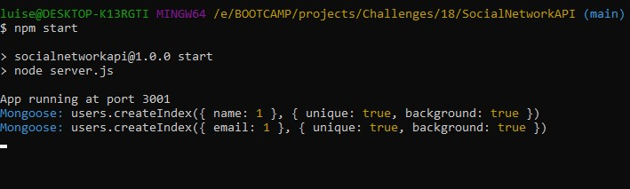
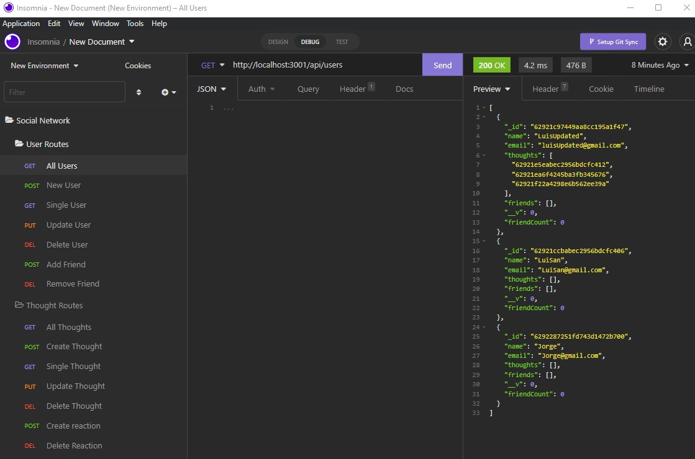

# Social Network API
Walkthrough Video: [https://drive.google.com/file/d/1eo9_fpZqU3ven55hoh89-_NZRxIUrchU/view](https://drive.google.com/file/d/1eo9_fpZqU3ven55hoh89-_NZRxIUrchU/view)
## ToC
- [Description](#description)
- [Features](#features)
- [Usage](#usage)
- [Preview](#preview)

## Description
Social network API demonstrates the back-end of a social app where u can create an account. add friends and post new thoughts, storing all the information into a mongoose database.

## Features 
- express.
- moment.js.
- Mongoose.

## Usage
Open command line and enter 'npm start', and test all routes in Insomnia.

## Preview

